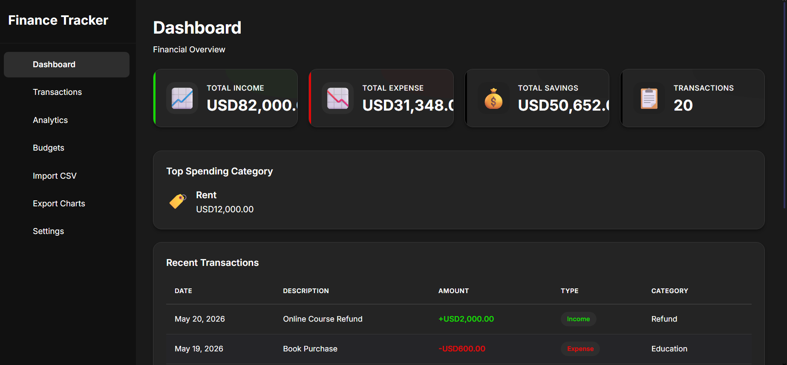
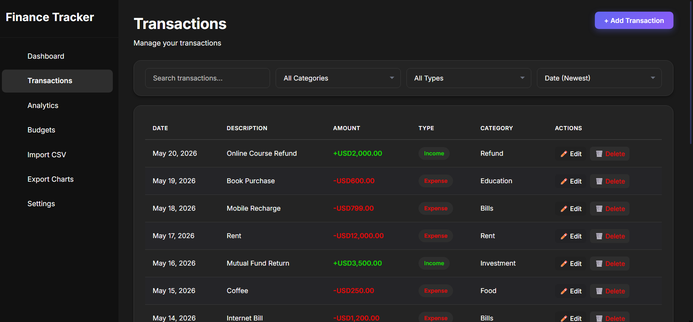
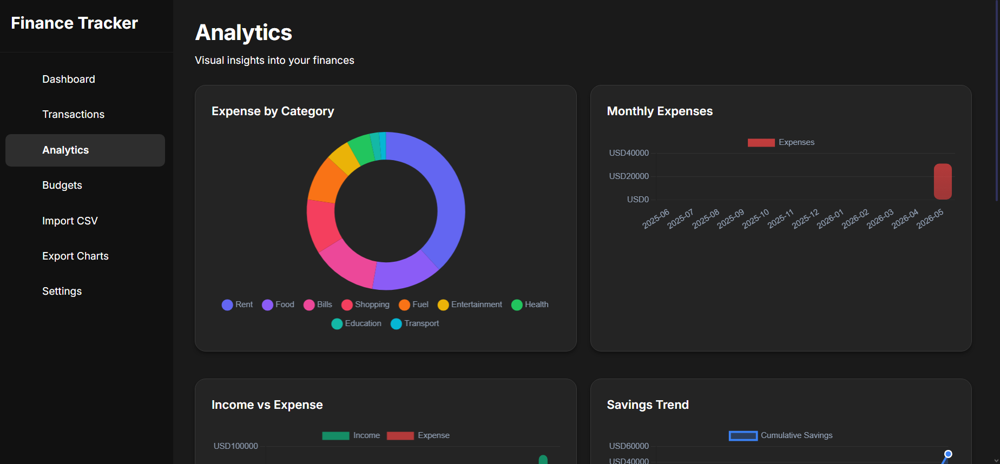
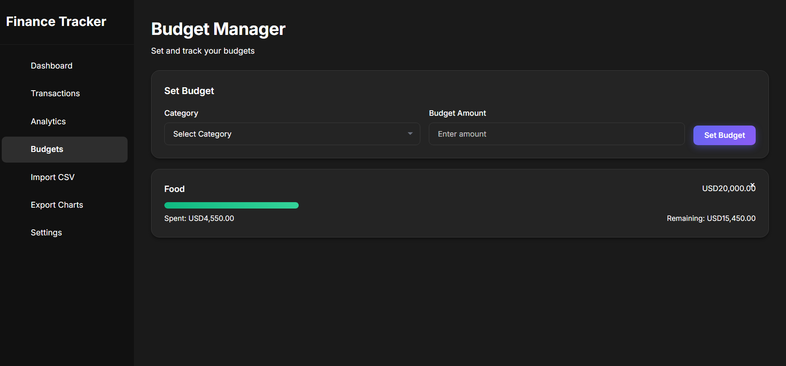

# FinTrack - Finance Tracker

## Description

FinTrack is a modern, single-page personal finance web application built with Flask. It allows users to track income and expenses, manage budgets, visualize financial data through interactive charts, and import/export transaction data via CSV — all from a clean dark-mode dashboard.

## Features

- 📊 **Dashboard Overview** — Real-time stats for total income, expenses, savings, and transaction count
- 💳 **Transaction Management** — Add, edit, delete, search, filter, and sort transactions
- 📈 **Analytics & Charts** — 7 interactive Chart.js visualizations (doughnut, bar, line charts)
- 🎯 **Budget Manager** — Set spending budgets per category with progress tracking
- 📁 **CSV Import** — Bulk-import transactions from a CSV file
- 📥 **Chart Export** — Download charts as PNG images
- 🌙 **Dark / Light Theme** — Toggle between themes with persistent preference
- 💱 **Multi-Currency Support** — Switch between USD, EUR, GBP, INR, JPY

## Technologies Used

- **Backend:** Python 3, Flask, Flask Blueprints
- **Frontend:** HTML5, CSS3 (Vanilla), JavaScript ES6+
- **Charts:** Chart.js
- **Fonts:** Google Fonts — Inter
- **Data Storage:** In-memory (Python dictionaries via `data_store.py`)

## Installation & Setup

1. **Clone the repository:**
   ```bash
   git clone https://github.com/your-username/finance_tracker.git
   cd finance_tracker
   ```

2. **Create a virtual environment (recommended):**
   ```bash
   python -m venv venv
   venv\Scripts\activate   # Windows
   source venv/bin/activate # macOS/Linux
   ```

3. **Install dependencies:**
   ```bash
   pip install -r requirements.txt
   ```

4. **Run the application:**
   ```bash
   python app.py
   ```

5. **Open in your browser:**
   ```
   http://localhost:5000
   ```

## Usage

| Section | Description |
|---|---|
| **Dashboard** | View financial overview and recent transactions |
| **Transactions** | Add/edit/delete transactions; filter by category, type, or keyword |
| **Analytics** | Browse 7 charts for spending patterns and trends |
| **Budgets** | Set monthly category budgets and track usage |
| **Import CSV** | Upload a CSV file with columns: `Date, Description, Amount, Type, Category` |
| **Export Charts** | Select and download any charts as PNG |
| **Settings** | Toggle dark mode, change currency, export or reset data |

### CSV Import Format

```
Date, Description, Amount, Type, Category
2024-01-15, Grocery Shopping, 45.50, Expense, Food
2024-01-16, Salary, 3000.00, Income, Salary
```

## Project Structure

```
finance_tracker/
├── app.py              # Flask entry point — registers all Blueprints
├── data_store.py       # In-memory data storage and default initialization
├── requirements.txt    # Python dependencies
├── routes/             # Flask Blueprint modules
│   ├── analytics.py
│   ├── budgets.py
│   ├── categories.py
│   ├── charts.py
│   ├── csv_routes.py
│   ├── settings.py
│   └── transactions.py
├── templates/
│   └── index.html      # Single-page application template
└── static/
    ├── css/
    │   └── style.css   # All application styles with CSS custom properties
    └── js/
        └── app.js      # All frontend logic (IIFE, strict mode, Chart.js)
```

## Screenshots

> Dashboard and Analytics views of the FinTrack application.




## Contributing

Contributions are welcome! To contribute:

1. Fork the repository
2. Create a feature branch: `git checkout -b feature/your-feature-name`
3. Commit your changes: `git commit -m "Add your feature"`
4. Push to the branch: `git push origin feature/your-feature-name`
5. Open a Pull Request

Please follow the existing code style (semantic HTML, CSS custom properties, `const`/`let`, arrow functions, JSDoc comments).

## License

This project is licensed under the **MIT License**.

```
MIT License

Copyright (c) 2024

Permission is hereby granted, free of charge, to any person obtaining a copy
of this software and associated documentation files (the "Software"), to deal
in the Software without restriction, including without limitation the rights
to use, copy, modify, merge, publish, distribute, sublicense, and/or sell
copies of the Software, and to permit persons to whom the Software is
provided to do so, subject to the following conditions:

The above copyright notice and this permission notice shall be included in
all copies or substantial portions of the Software.

THE SOFTWARE IS PROVIDED "AS IS", WITHOUT WARRANTY OF ANY KIND, EXPRESS OR
IMPLIED, INCLUDING BUT NOT LIMITED TO THE WARRANTIES OF MERCHANTABILITY,
FITNESS FOR A PARTICULAR PURPOSE AND NONINFRINGEMENT.
```

